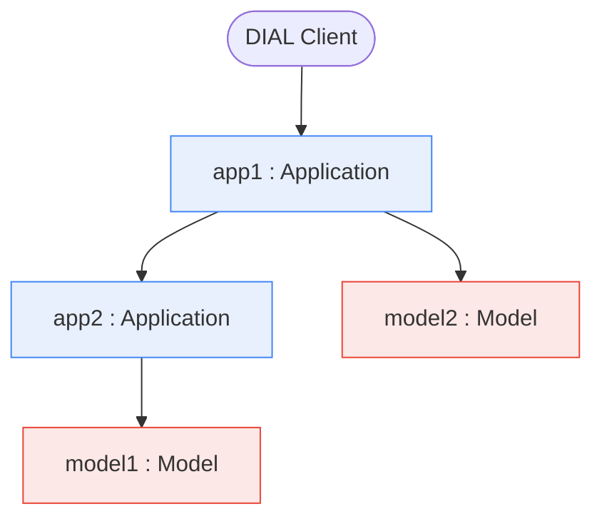
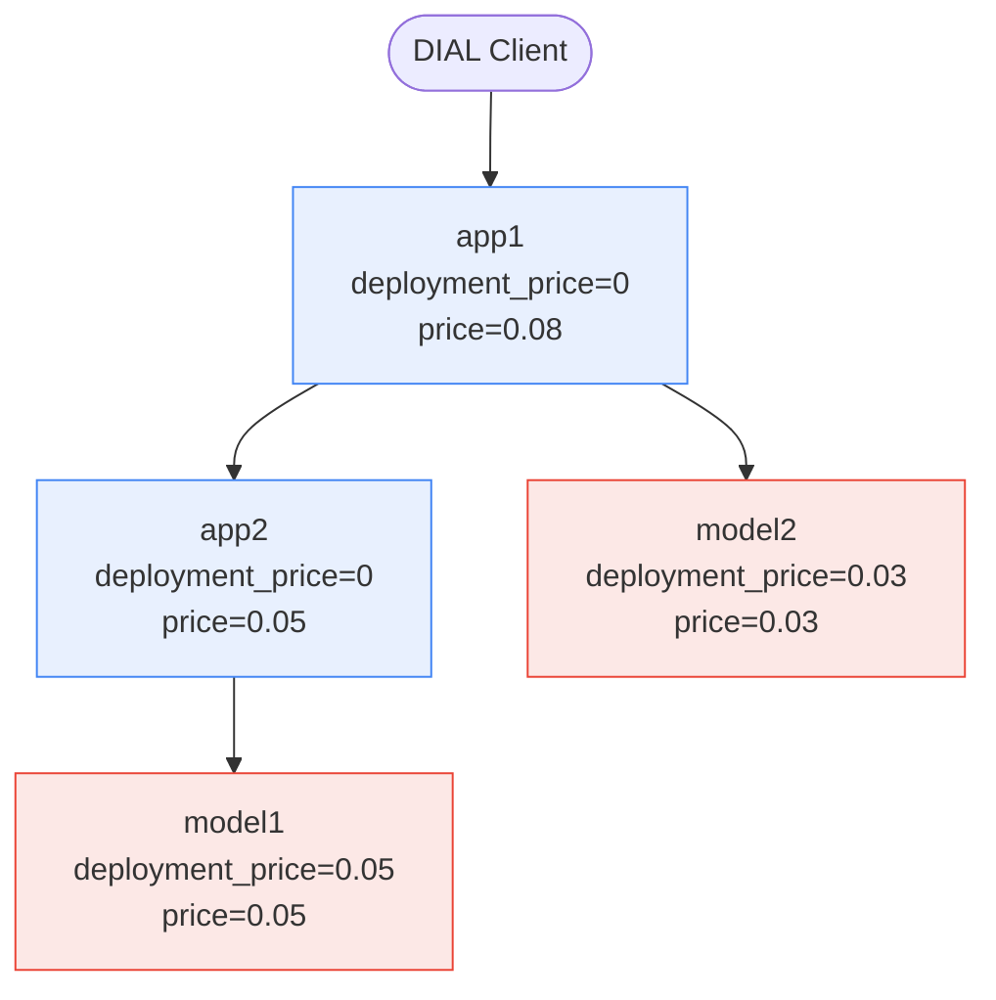

<h1 align="center">
  DIAL Realtime analytics
</h1>
<p align="center">
  <p align="center">
  <a href="https://dialx.ai/">
    
  </a>
</p>
<h4 align="center">
  <a href="https://discord.gg/ukzj9U9tEe">
    
  </a>
</h4>

- [Overview](#overview)
  - [Usage](#usage)
  - [InfluxDB schema](#influxdb-schema)
    - [Distributed tracing data model](#distributed-tracing-data-model)
    - [Chat completion and embedding requests](#chat-completion-and-embedding-requests)
    - [Rate requests](#rate-requests)
    - [MCP requests](#mcp-requests)
    - [Route request](#route-request)
  - [Configuration](#configuration)
    - [Connection to the InfluxDB](#connection-to-the-influxdb)
      - [InfluxDB 2](#influxdb-2)
      - [InfluxDB 3](#influxdb-3)
    - [Aggregated Dashboards (Optional)](#aggregated-dashboards-optional)
    - [Other configuration](#other-configuration)
    - [Logging](#logging)
  - [Development](#development)
    - [Development Environment](#development-environment)
    - [Setup](#setup)
    - [Build](#build)
    - [Run](#run)
    - [Docker](#docker)
    - [Lint](#lint)
    - [Test](#test)
    - [Clean](#clean)
    - [Git hooks](#git-hooks)

# Overview

Realtime analytics server for [AI DIAL](https://dialx.ai). The service consumes the logs stream from [AI DIAL Core](https://github.com/epam/ai-dial-core), analyzes the conversation and writes the analytics to the [InfluxDB](https://www.influxdata.com/).

Refer to [Documentation](https://github.com/epam/ai-dial/blob/main/docs/tutorials/2.devops/1.configuration/2.realtime-analytics-config.md) to learn how to configure AI DAL Core and other necessary components.

## Usage

Check the [AI DIAL Core](https://github.com/epam/ai-dial-core) documentation to configure the way to send the logs to the instance of the realtime analytics server.

## InfluxDB schema

The realtime analytics server analyzes the logs stream provided by [Vector](https://vector.dev/docs/reference/configuration/sinks/http/) in the realtime and writes metrics to the InfluxDB.

### Distributed tracing data model

Every row in every measurement below is one **span** in the usual distributed-tracing sense — one DIAL request. Field-to-tracing-terms mapping:

|Field|Distributed tracing equivalent|
|---|---|
|`trace_id`|Trace ID — groups every span caused by one DIAL Client request.|
|`core_span_id`|Span ID. `trace_id` + `core_span_id` uniquely identifies a span (a DIAL request).|
|`core_parent_span_id`|Parent span ID — the span that directly triggered this one. Empty/absent for the root span. Walking these links reconstructs the whole call tree.|
|`execution_path`|The full ancestor chain as deployment names, root-first, current span's deployment last. Empty for the root span.|

A root DIAL Client call can fan out into a whole tree, because a DIAL application can itself call other DIAL deployments to build its answer:



DIAL **models** and DIAL **applications** are disjoint deployment kinds:

- **Model** — makes the actual LLM call. Always a leaf: it never calls another DIAL deployment.
- **Application** — ad-hoc logic; either answers on its own or fans out to other applications/models and composes their answers. Always an inner node (or a childless root).

For the tree above, `trace_id` is shared by all 4 spans; `core_parent_span_id`/`execution_path` encode the edges:

|deployment|execution_path|parent_deployment|
|---|---|---|
|app1|*(empty)*|*(none)* — root|
|app2|app1|app1|
|model2|app1|app1|
|model1|app1/app2|app2|

#### Avoiding double counting when summing price

`deployment_price` is the cost of *that one span only*. `price` is cumulative — that span's `deployment_price` plus `price` of everything below it in the tree. So a span's `price` already includes its descendants' cost, and summing `price` across a whole bundle counts shared ancestors' subtrees multiple times.



The true total cost of the user's request is **0.08**. Two correct ways to get it, one wrong way:

- ✅ `price` of the root span only (`execution_path` empty): **app1.price = 0.08**.
- ✅ `sum(deployment_price)` over every span sharing the `trace_id`: `0 + 0 + 0.03 + 0.05 = 0.08`.
- ❌ `sum(price)` over every span sharing the `trace_id`: `0.08 + 0.05 + 0.03 + 0.05 = 0.21` — `model1`'s cost is counted once in its own `price` and again inside `app2.price` and again inside `app1.price`.

### Chat completion and embedding requests

The logs for `/chat/completions` and `/embeddings` endpoints are saved to the `analytics` measurement with the following tags and fields:

|Tag|Description|
|---|---|
|model|The model name for the request.|
|deployment|The deployment name of the model or application for the request.|
|parent_deployment|The deployment name of the model or application that called the current deployment.|
|execution_path|A `/`-separated string of deployment names representing the call stack of the request. E.g. `app1/app2/model1` means `app1` called `app2` and `app2` called `model1`. The last segment equals to the `deployment` tag. The penultimate segment *(when present)* equals to the `parent_deployment` tag. Forward slashes within a segment name are escaped as `\/` (e.g. `app1\/sub/app2` has `app1/sub` as its first segment).|
|trace_id|OpenTelemetry trace ID.|
|core_span_id|OpenTelemetry span ID generated by DIAL Core.|
|core_parent_span_id|OpenTelemetry span ID generated by DIAL Core that called the span `core_span_id`.|
|project_id|The project ID for the request.|
|language|The language detected for the content of the request.|
|upstream|The upstream endpoint used by the DIAL model.|
|topic|The topic detected for the content of the request.|
|title|The title of the person making the request.|
|response_id|Unique ID of the response. For chat completion response it equals to `id` response field; for embedding request - it's generate from scratch as UUID.|

|Field|Type|Description|
|---|---|---|
|user_hash|string|The unique hash identifying the user.|
|deployment_price|float|The cost of this specific request, excluding the cost of any requests it directly or indirectly initiated.|
|price|float|The total cost of the request, including the cost of this request and all related requests it directly or indirectly triggered. It always holds that `price>=deployment_price`.|
|number_request_messages|int|The total number of messages in the request. For chat completion requests it's number of messages in the chat history. For embedding requests it's number of inputs.|
|chat_id|string|The unique identifier for the conversation that this request is part of.|
|prompt_tokens|int|The number of tokens in the request.|
|cached_prompt_tokens|int|The number of tokens read from the model cache. `cached_prompt_tokens` <= `prompt_tokens`|
|completion_tokens|int|The number of tokens in the response.|

### Rate requests

The logs for the `/rate` endpoint are saved to the `rate_analytics` measurement:

|Tag|Description|
|---|---|
|deployment|The deployment name of the model or application for the request.|
|project_id|The project ID for the request.|
|title|The title of the person making the request.|
|response_id|Unique ID of the response.|
|user_hash|The unique hash identifying the user.|
|chat_id|The unique identifier for the conversation that this request is part of.|

|Field|Type|Description|
|---|---|---|
|dislike_count|int|1 for a thumbs up request, otherwise 0.|
|like_count|int|1 for a thumbs down request, otherwise 0.|

### MCP requests

The logs for the `/mcp` endpoint are saved to the `mcp_analytics` measurement. Both toolset and application MCP endpoints are supported:

- `HTTP_METHOD /v1/toolset/TOOLSET_NAME/mcp` — DIAL toolset MCP endpoint.
- `HTTP_METHOD /v1/deployments/DEPLOYMENT_NAME/mcp` — Application MCP endpoint.

|Tag|Description|
|---|---|
|project_id|The project ID for the request.|
|title|The title of the person making the request.|
|deployment|The deployment name of a DIAL toolset or application corresponding to the MCP call.|
|parent_deployment|The deployment name of the model or application that called the DIAL toolset or application.|
|mcp_method|MCP method name such as `tools/list`, `tools/call` etc.|

|Field|Type|Description|
|---|---|---|
|execution_path|string|A `/`-separated string of deployment names representing the call stack of the request. E.g. `app1/app2/toolset1` means `app1` called `app2` and `app2` called `toolset1`. The last segment equals to the `deployment` tag. The penultimate segment *(when present)* equals to the `parent_deployment` tag. Forward slashes within a segment name are escaped as `\/` (e.g. `app1\/sub/toolset1` has `app1/sub` as its first segment).|
|chat_id|string|The unique identifier for the conversation that this request is part of.|
|user_hash|string|The unique hash identifying the user.|
|upstream|string|The upstream endpoint of the DIAL toolset.|
|trace_id|string|OpenTelemetry trace ID.|
|core_span_id|string|OpenTelemetry span ID generated by DIAL Core.|
|core_parent_span_id|string|OpenTelemetry span ID generated by DIAL Core that called the span `core_span_id`.|
|mcp_tool_call_name|string|The name of the requested tool given that `mcp_method` equal to `tools/call`.|

### Route request

The logs for the [DIAL route endpoints](https://github.com/epam/ai-dial-core/blob/19ee57beba4350f1e7b99f933175d5b0465f61d3/docs/dynamic-settings/routes.md#calling-route) - `HTTP_METHOD /v1/deployments/DEPLOYMENT_NAME/route/ROUTE_PATH` - are saved to the `routes_analytics` measurement:

|Tag|Description|
|---|---|
|project_id|The DIAL project ID associated with the request.|
|title|The job title of a DIAL user who initiated the request.|
|route_path|Route path, always with a leading slash `/`.|
|http_method|HTTP method.|
|deployment|The DIAL deployment whose route endpoint has been called.|
|parent_deployment|The DIAL deployment *(be it a model or an application)*, that called the route endpoint.|

|Field|Type|Description|
|---|---|---|
|execution_path|string|A `/`-separated string of deployment names representing the call stack of the request. E.g. `app1/app2/deployment1` means `app1` called `app2` and `app2` called `deployment1`. The last segment equals to the `deployment` tag. The penultimate segment *(when present)* equals to the `parent_deployment` tag. Forward slashes within a segment name are escaped as `\/` (e.g. `app1\/sub/deployment1` has `app1/sub` as its first segment).|
|chat_id|string|The unique identifier for the conversation that this request is part of.|
|user_hash|string|The unique hash identifying the DIAL user.|
|upstream|string|The upstream endpoint of the route.|
|trace_id|string|OpenTelemetry trace ID.|
|core_span_id|string|OpenTelemetry span ID generated by DIAL Core.|
|core_parent_span_id|string|OpenTelemetry span ID generated by DIAL Core that called the span `core_span_id`.|

> [!NOTE]
> Only the requests with the HTTP status code 200 are processed by the analytics server.

## Configuration

Copy `.env.example` to `.env` and customize it for your environment.

### Connection to the InfluxDB

#### InfluxDB 2

You need to specify the connection options to the InfluxDB instance using the environment variables:

|Variable|Description|
|---|---|
|INFLUX_URL|URL to the InfluxDB to write the analytics data|
|INFLUX_ORG|Name of the InfluxDB organization to write the analytics data|
|INFLUX_BUCKET|Name of the bucket to write the analytics data|
|INFLUX_API_TOKEN|InfluxDB API Token|

You can follow the [InfluxDB 2 documentation](https://docs.influxdata.com/influxdb/v2/get-started/) to setup InfluxDB locally and acquire the required configuration parameters.

#### InfluxDB 3

You need to specify the connection options to the InfluxDB instance using the environment variables:

|Variable|Description|
|---|---|
|INFLUX_URL|URL to the InfluxDB to write the analytics data|
|INFLUX_DATABASE|Name of the InfluxDB 3 database to write the analytics data|
|INFLUX_API_TOKEN|InfluxDB API Token with the write access to the target database|

You can follow the [InfluxDB 3 documentation](https://docs.influxdata.com/influxdb3/core/get-started/) to setup InfluxDB locally and acquire the required configuration parameters.

> [!IMPORTANT]
> The `INFLUX_DATABASE` variable was introduced in version 0.22.0. For earlier versions set `INFLUX_BUCKET` variable to the target database name and `INFLUX_ORG` variable to any non-empty value (e.g. "ignored") to enable the InfluxDB 3 support.

### Aggregated Dashboards (Optional)

This project includes optional **aggregated Grafana dashboards** that visualize 6-hours and monthly trends.

To enable these dashboards, you must **manually create the required InfluxDB buckets and tasks**. These steps are **not automated** via Helm and must be applied manually.

See [influxdb/README.md](dashboards/customized/influxdb/README.md) for full instructions.

> [!IMPORTANT]
> Aggregated Dashboards are only supported for InfluxDB 2.

### Other configuration

Also, following environment valuables can be used to configure the service behavior:

|Variable|Default|Description|
|---|---|---|
|TOPIC_MODEL||Specifies the name or path for the topic model. If the model is specified by name, it will be downloaded from the [Huggingface]( https://huggingface.co/). When unset or set to an empty string, the topic classification feature is disabled.|
|TOPIC_EMBEDDINGS_MODEL||Specifies the name or path for the embeddings model used with the topic model. If the model is specified by name, it will be downloaded from the [Huggingface]( https://huggingface.co/). When unset or set to an empty string, the name will be used from the topic model config.|
|LOG_LEVEL|INFO|Application log level. Use DEBUG for dev purposes and INFO in prod|

### Logging

Logging is provided by the DIAL SDK. The `LOG_LEVEL` variable sets the severity threshold for the application's own logs (`INFO` by default; use `DEBUG` for development).

By default logs are emitted as human-readable text.
Set `DIAL_SDK_LOG_FORMAT=json` for structured JSON logging.
The format is controlled by `DIAL_SDK_TEXT_LOG_FORMAT` / `DIAL_SDK_JSON_LOG_FORMAT` (both optional),
which use Python's `%`-style [logging attributes](https://docs.python.org/3/library/logging.html#logrecord-attributes)
and default to the values shown below.

Text logging (default):

```txt
DIAL_SDK_LOG_FORMAT=text
DIAL_SDK_TEXT_LOG_FORMAT='%(levelprefix)s | %(asctime)s | %(name)s | %(process)d | %(message)s'
```

Structured JSON logging:

```txt
DIAL_SDK_LOG_FORMAT=json
DIAL_SDK_JSON_LOG_FORMAT='{"level": "%(levelname)s", "time": "%(asctime)s", "logger": "%(name)s", "process": "%(process)d", "message": "%(message)s"}'
```

See the [full logging documentation](https://github.com/epam/ai-dial-sdk/blob/0.38.0/docs/logging.md) for details.

## Development

### Development Environment

This project requires [Python ≥3.11](https://www.python.org/downloads/) and [Poetry ≥2.1.1](https://python-poetry.org/) for dependency management.

### Setup

1. Install Poetry. See the official [installation guide](https://python-poetry.org/docs/#installation).

2. *(Optional)* Specify custom Python or Poetry executables in `.env.dev`. This is useful if multiple versions are installed. By default, `python` and `poetry` are used.

   ```sh
   POETRY_PYTHON=path-to-python-exe
   POETRY=path-to-poetry-exe
   ```

3. Create and activate the virtual environment:

   ```sh
   make init_env
   source .venv/bin/activate
   ```

4. Install project dependencies (including linting, formatting, and test tools):

   ```sh
   make install
   ```

### Build

To build the wheel packages run:

```sh
make build
```

### Run

To run the development server locally run:

```sh
make serve
```

The server will be running as `http://localhost:5001`

### Docker

To build the docker image run:

```sh
make docker_build
```

To run the server locally from the docker image run:

```sh
make docker_serve
```

The server will be running as `http://localhost:5001`

### Lint

Run the linting before committing:

```sh
make lint
```

To auto-fix formatting issues run:

```sh
make format
```

### Test

Run unit tests locally:

```sh
make test
```

### Clean

To remove the virtual environment and build artifacts:

```sh
make clean
```

### Git hooks

You may optionally install Git hooks that will automatically run the linting step on Git push. You only need to do it once for the given repository.

```sh
make install_git_hooks
```

> [!IMPORTANT]
> This command doesn't work if you have already installed Git hooks locally or globally.
